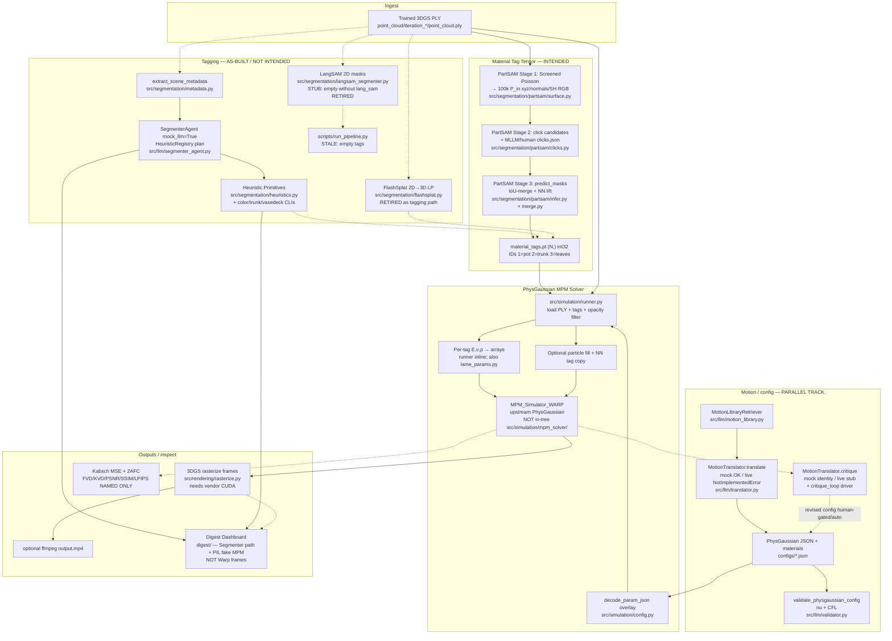

# Pipeline design philosophy, necessity, and novelty

**Date:** 2026-08-15  
**Repo:** Phys4DGS (`/workspace`)  
**Authority order:** `src/` + live specs under `.scratch/*/spec.md` > `docs/agents/orientation.md` + `01-repo-current-state.md` > historical sediment (`.scratch/agent-orientation/historical/`, root stubs, `CHANGELOG.md`).  
**Absent in this checkout (not invented):** `Paper_Writing/`, `docs/adr/`, root `Dev Plan.md` (disposition map says it was archived; only `design_decisions.md` / `digest.md` / `issues/` appear under historical).

## 1. Executive summary

Phys4DGS is a **delta** on PhysGaussian: it takes a **trained 3DGS checkpoint**, produces a discrete **Material Tag Tensor** `(N,)`, maps tags to per-particle continuum parameters, runs **heterogeneous Warp MPM**, and **re-rasterizes** moved Gaussians. Time variation is physics on particles, not a Yang-style 4DGS trainer (`docs/agents/orientation.md`, `README.md`, `pyproject.toml` name vs empty trainer in `src/`). The **intended production tagging path** is PartSAM (surface → clicks → mask/merge/lift → `material_tags.pt`) wired through `src/segmentation/partsam` and `scripts/run_pipeline.sh`; Heuristic Primitives + Segmenter Agent remain the offline/digest path and are explicitly **not** the lasting tagger (`.scratch/partsam-as-tagger/spec.md`). Parallel to tagging, a **Motion Critique Loop** retunes runner `--config` from human text (and optional frames) while freezing tag membership (`.scratch/mpm-critique-loop/spec.md`); mock `critique` + driver exist, live LLM does not. Necessity is well argued for **heterogeneous tags + Lamé overlay + CFL guardrails** relative to homogeneous PhysGaussian configs; PartSAM-as-tagger and post-run critique are **policy-justified but only thinly evidenced** (one ficus trial; no full wind campaign; live critique unimplemented). Novelty vs cited baselines is **composition and seams** (native-3D part → material IDs → per-particle MPM; LLM motion/critique; Segmenter Agent heuristics), not a new MPM kernel or 4DGS field.

---

## 2. Full pipeline graph (intended and as-built)

Legend: **solid** = intended / wired production path; **dashed** = as-built alternate, digest/test, or stub; labels mark stubs.

**Path status (from orientation + code, not marketing):**

| Path | Status |
| --- | --- |
| PartSAM → `material_tags.pt` → `runner` | Intended; CLI + `run_pipeline.sh` wired; needs CUDA/conda + gitignored clones/weights |
| Segmenter Agent → tags | Working offline (`mock_llm=True`); digest/tests; **not** intended lasting producer |
| FlashSplat / LangSAM | Code present; **retired** as tagging policy; LangSAM empty without dep |
| MotionTranslator live `translate`/`critique` | `NotImplementedError` |
| Critique loop driver | Wired mock (`src/llm/critique_loop.py`) |
| Warp MPM + rasterize | Working only with PhysGaussian/3DGS CUDA stack |
| Digest “MPM” frames | PIL offsets in `scripts/export_pipeline_data.py`, not Warp |
| Yang-style 4DGS trainer | **Does not exist** in `src/` |

---

## 3. Stage-by-stage walkthrough (with citations)

### 3.1 Load trained 3DGS

- **What:** Checkpoint PLY under `model_path/point_cloud/iteration_*/point_cloud.ply`.
- **Code:** `src/simulation/runner.py` (`load_checkpoint` / `GaussianModel.load_ply`); also `src/rendering/checkpoint.py`; PartSAM resolves the same path in `src/segmentation/partsam/surface.py` (`resolve_checkpoint_ply`).
- **Upstream:** `src/upstream.py` puts PhysGaussian + its `gaussian-splatting` on `sys.path`; clones are gitignored (`README.md`).
- **Necessity:** Without a trained static 3DGS, there are no particles to tag or move. The project explicitly outscopes retraining 3DGS (`.scratch/llm-motion-physgaussian/spec.md` Out of Scope; orientation Purpose).

### 3.2 Produce Material Tag Tensor

**Intended — PartSAM recipe** (`.scratch/partsam-as-tagger/spec.md`):

1. **Surface sample:** Screened Poisson from Gaussian means → area-sample 100k with normals → bake SH RGB (`surface.py`). Persist `sample_100k.npz`; throw away mesh as non-solver input.
2. **Clicks:** Geometry proposes pot/trunk/leaves candidates; MLLM/human writes `clicks.json` (`clicks.py`). Skip if clicks exist.
3. **Masks / merge / lift:** `predict_masks` per group (PartSAM env + FPS stand-in `fps.py`); merge by **highest chosen IoU**, smaller mask on ties (`merge.py`); NN-lift onto **every** Gaussian **before** opacity filter. Output IDs **1/2/3** only.

Evidence: ficus trial passed ingest + short MPM (`.scratch/partsam-ficus-trial/RESULT.md`) with caveats (oversized trunk from overlap). Production policy: PartSAM lasting; FlashSplat/LangSAM retired; heuristics unchanged-but-not-intended (`partsam-as-tagger/spec.md` tables).

**As-built alternate — Heuristic Primitives + Segmenter Agent:**

- Primitives: chromatic SH, spatial cutoffs, anisotropy, DBSCAN, superpoint_graph, etc. (`src/segmentation/heuristics.py`; glossary in `CONTEXT.md`).
- Agent: metadata → `SegmenterExecutionPlan` JSON → execute tags (`src/llm/segmenter_agent.py`); iterative refinement uses plan metrics and mock insert of `superpoint_graph` (historical ticket-017; orientation: “Segmenter Agent iteration is plan metrics”).
- Digest export runs this path and invents trajectory images (`scripts/export_pipeline_data.py`).

**Retired / stubbed:**

- FlashSplat LP from 2D masks (`flashsplat.py`); historical priority stem>leaves (`design_decisions.md`).
- LangSAM empty masks without `lang_sam` (`langsam_segmenter.py`).
- `scripts/run_pipeline.py` writes empty tags (orientation / `01-repo-current-state.md`).

### 3.3 Map tags → continuum parameters

- Config overlay: JSON `materials` map string/int → `{E, nu, density}` (`src/simulation/config.py` extends PhysGaussian `decode_param_json`; example `configs/ficus.json` keys `"1"|"2"|"3"`).
- Runner builds per-particle `E_array` / `nu_array` / `density_array` from tags (`runner.py` ~266–280). Helper Lamé μ, λ also in `src/simulation/lame_params.py`.
- Tags come **only** from CLI `--tags_path`, not from JSON (critique-loop research summary in `.scratch/mpm-critique-loop/issues/01-config-json-vs-runner-ingest.md`).
- Filled interior particles inherit nearest Gaussian’s tag (`runner.py` KDTree).

**Without this stage:** homogeneous PhysGaussian `material` / global E applies to all particles — multi-part objects (rigid pot + stiff trunk + soft leaves) cannot differ in response (problem statement in `.scratch/llm-motion-physgaussian/spec.md`).

### 3.4 PhysGaussian MPM Solver

- `MPM_Simulator_WARP` imported after `ensure_simulation_path()` — **upstream clone**, not `src/simulation/mpm_solver/solver.py` (that path is named in orientation as conceptual; **as-built tree has only** `runner.py`, `config.py`, `lame_params.py` under `src/simulation/`).
- Boundary conditions, timesteps, gravity from JSON; `finalize_mu_lam`; `p2g2p` loop; optional PLY/H5 dumps (`runner.py`).
- Cloud VM cannot run this (AGENTS.md / orientation: CUDA + checkpoints).

### 3.5 Rasterize / video

- After each frame, positions (and cov) feed 3DGS rasterizer (`src/rendering/rasterize.py` re-exports PhysGaussian helpers). Optional `--compile_video`.
- Digest Dual-Mode Frame Player: glossary claims canvas + HTML5 video; UI is image scrubbing only (`01-repo-current-state.md`).

### 3.6 Motion config synthesis (parallel, incomplete)

- Few-shot library + mock `translate` (`motion_library.py`, `translator.py`); CFL/ν validator (`validator.py`).
- Live API: `NotImplementedError`.
- `ConfigGenerator` always forces mock (`src/utils/llm_generator.py` per current-state report).

### 3.7 Motion Critique Loop (post-run retune)

- Spec: required human text; optional visual describe of `--render_img` PNGs; complete next `--config`; frozen `materials` key set; tags CLI-only (`.scratch/mpm-critique-loop/spec.md`).
- As-built: mock identity `critique`; driver `run_critique_loop` human-gated/auto (`critique_loop.py`); validator omit/frozen materials when `previous=` set (`validator.py`).
- **Does not** change which Gaussian holds which ID.

### 3.8 Evaluation

- Implemented: Kabsch trajectory MSE, 2AFC helpers (`evaluate_realism.py`); effort timer wall-clock/LOC/iterations (`evaluate_effort.py`) — **not** NASA-TLX subscales.
- Named but unimplemented: FVD/KVD/PSNR/SSIM/LPIPS (docstring + orientation).

---

## 4. Design philosophy and necessity

### 4.1 Core thesis (repo’s own words)

> Phys4DGS runs **heterogeneous MPM on trained 3DGS scenes**. A **Material Tag Tensor** labels each Gaussian; those labels become per-particle Lamé parameters; the **PhysGaussian MPM Solver** moves the particles in time; frames are re-rasterized 3DGS.  
> — `docs/agents/orientation.md`

> This repository is the **delta** (segmentation, LLM config, Lamé overlay, digest dashboard). It does **not** vendor PhysGaussian…  
> — `README.md`

> Manually tuning parameters and tagging 3D point clouds is error-prone, time-consuming (>25 minutes per scene), and often leads to numerical solver explosions due to CFL…  
> — `.scratch/llm-motion-physgaussian/spec.md`

Philosophy in one line: **keep PhysGaussian’s solver/rasterizer; add the missing multi-material membership + safer/faster config authorship.**

### 4.2 Why each stage exists / what fails without it

| Stage | Why it exists | Failure mode without it |
| --- | --- | --- |
| Trained 3DGS load | Appearance + particle geometry already optimized | No scene to simulate; out of scope to retrain |
| Discrete Material Tag Tensor | Membership seam between vision and continuum params (`CONTEXT.md`) | Cannot assign different E/ν/ρ to pot vs foliage; one global material |
| Heterogeneous `materials` + Lamé arrays | PhysGaussian baseline is largely homogeneous; overlay is the delta (`config.py`) | Soft leaves and rigid pot share stiffness → wrong motion or need manual particle edits |
| CFL / ν validator | Explicit MPM blows up on stiff E or ν→0.5 (`validator.py`, RFC) | Silent bad configs → “solver explosions” (RFC problem statement) |
| PartSAM (intended) | Native-3D parts avoid failed 2D lift on thin trunks (`design_decisions.md`: LangSAM ~10–100 trunk Gaussians; SH heuristic workaround; PartSAM trial trunk >1k) | Heuristics are scene-fragile; 2D lift noisy; FlashSplat retired by policy |
| Heuristics + Segmenter Agent | Offline CPU path, digest, tests; declarative plans | Without them, no CPU-demo tagging; but they are **not** lasting policy |
| Motion Translator | NL → JSON to cut setup effort (RFC user stories) | Manual JSON forever; **live path still missing** so necessity is aspirational |
| Motion Critique Loop | Tags frozen; params/BCs need human-in-the-loop retune after watching frames (critique spec) | Exp notes historically “trunk does not fully rebound” (orientation); without loop, only hand-edit JSON |
| Digest Dashboard | Inspect tags / plans / (mock) trajectories without Warp | Harder multi-model QA; not solver evidence |
| Eval suite | Compare realism vs effort (RFC) | Incomplete metrics → cannot claim gold-standard yet |

### 4.3 Explicit non-goals (constrain philosophy)

- No Yang-style HexPlane / deformation-field **4DGS trainer** (orientation; agent-orientation `map.md` out of scope).
- No replacing Warp MPM with custom kernels (RFC leftover “custom CUDA” still fog; critique spec out of scope).
- PartSAM does **not** emit materials or run MPM (`02-partsam-tagging-gap.md`); mapping parts→IDs is this repo’s seam.
- Critique does **not** rewrite the tag tensor (critique spec “Frozen Material Tag Tensor”).

---

## 5. Justification gaps and proposed experiments

Gaps where design is **policy or architecture** ahead of **measured necessity**:

1. **PartSAM as sole lasting producer** — Go/no-go YES on one ficus trial; trunk oversized; no second scene; no full-length wind campaign (`partsam-as-tagger/spec.md`, `RESULT.md`).
2. **Heuristics “not intended” yet still power digest** — risk of agents treating digest quality as PartSAM quality.
3. **Live MotionTranslator / live critique** — necessity argued in RFC; as-built only mocks → no evidence that LLM critique reduces iterations vs hand JSON.
4. **Gold-standard metrics** — FVD/KVD/image metrics unimplemented; no sim-vs-GT suite on real Warp video.
5. **Digest frames ≠ Warp** — visual QA of “MPM” in dashboard is not physics evidence.
6. **Name “4DGS”** — packaging vs architecture mismatch can mislead readers (`pyproject.toml` vs orientation).

### Proposed experiments (concrete; prefer CPU offline surface)

**A. Tagging necessity (CPU-offline where possible)**

| ID | Experiment | Runnable here? | Pass signal |
| --- | --- | --- | --- |
| A1 | Synthetic multi-material cloud: run `SegmenterAgent(mock_llm=True).execute_with_iterative_refinement` vs single global tag; compare `SegmentationMetrics` (silhouette, speckle) | Yes — `PYTHONPATH=src .venv/bin/python -m unittest tests.test_segmenter_agent tests.test_segmentation_metrics` + small script | Heterogeneous plan metrics strictly better than all-one-tag baseline on synthetic pot/trunk/leaves |
| A2 | Ablation: remove `color_sh` wood rule on ficus-like synthetic SH (R-dominant trunk) — count trunk tags | Yes — unit test on `heuristics.py` | Trunk count collapses without chromatic rule (reproduces `design_decisions.md` failure mode offline) |
| A3 | PartSAM merge policy unit tests: overlap → highest IoU wins; tie → smaller mask (`tests.test_partsam_merge`) | Yes | Spec merge ≠ trial’s named trunk>leaves>pot order |
| A4 | When CUDA available: same `configs/ficus.json` with PartSAM tags vs all-tag=leaves vs all-tag=pot; compare Kabsch MSE of particle trajectories to a hand-tuned reference PLY dump | No on Cloud VM | Heterogeneous tags reduce leaf tip error vs homogeneous soft/hard |

**B. Config / critique necessity**

| ID | Experiment | Runnable here? | Pass signal |
| --- | --- | --- | --- |
| B1 | Feed stiff E + large `substep_dt` into `validate_physgaussian_config`; assert ValueError | Yes — `tests.test_schema_and_cfl` | Guardrail catches known-bad configs |
| B2 | Critique mock loop: `run_critique_loop` with identity mock + fake solver writing empty frames; assert frozen materials key set on mutated config rejected | Yes — `tests.test_motion_critique` | Validator enforces critique revision shape without Warp |
| B3 | Human protocol (when live LLM exists): N scenes, measure `ConfigurationEffortTracker` iterations for (hand JSON) vs (translate) vs (critique loop) | Partial offline (tracker only) | Lower `n_iter` / `t_setup` with critique — **not yet runnable end-to-end** |

**C. Novelty / baseline contrast (measurement)**

| ID | Experiment | Runnable here? | Pass signal |
| --- | --- | --- | --- |
| C1 | Document-only: map PhysGaussian homogeneous config fields vs Phys4DGS `materials` + `--tags_path` on `configs/ficus.json` | Yes | Explicit field delta checklist |
| C2 | Kabsch MSE on synthetic trajectories (`compute_trajectory_mse_kabsch`) as stand-in until FVD exists | Yes | Eval path exercises without video models |
| C3 | When Warp available: short run with/without tags arrays in `material_params` | No here | Visual/quantitative difference confirms overlay is load-bearing |

Until A4/B3/C3 exist, **heterogeneous tagging + CFL** are the best-justified stages; **PartSAM monopoly** and **LLM critique** remain **hypotheses with partial trials**.

**D. Strongest necessity experiment (GPU; not Cloud-CPU)**

| ID | Experiment | Pass signal |
| --- | --- | --- |
| D1 | Same ficus tags ignored (homogeneous soft / homogeneous stiff) vs `configs/ficus.json` hetero `materials` under identical wind BCs; short `frame_num` | Soft-homo moves pot; stiff-homo kills leaf sway; hetero keeps pot anchored with foliage motion — load-bearing proof for the Material Tag Tensor seam |

---

## 5b. Issue-history arc (how the pipeline was forced into this shape)

Compressed from maps/tickets (sediment + live specs):

1. **RFC** (`.scratch/llm-motion-physgaussian/`): NL config + hybrid segmentation + gold metrics; problem framed as >25 min/scene manual JSON and CFL explosions.
2. **Heuristic + Segmenter Agent** (historical map-001, tickets 001–005, 017): generalize tagging beyond ficus SH scripts; iterative plan refinement on segmentation metrics.
3. **2D lift pain** (`design_decisions.md`): retire Grounded SAM 2 (CUDA/PyTorch conflict); FlashSplat Z-priority hacks; SH trunk rescue after LangSAM found ~10–100 trunk Gaussians.
4. **PartSAM trial → go/no-go YES → `src/` wiring → `run_pipeline.sh`** (`partsam-ficus-trial`, `partsam-as-tagger`, `partsam-src-wiring`): intended producer replaces FlashSplat on the main runner.
5. **Live-tag-fix** map: treat solver explosions (e.g. CUDA 700) as **tag occupancy** bugs (zero trunk), not Warp kernel bugs.
6. **Motion Critique Loop** graduates from RFC “real-time feedback” fog into frozen-tags config retune; mock wired in `src/llm/critique_loop.py`.
7. **GitHub-ready**: consume PhysGaussian as upstream clone; keep delta thin (`README.md`, `.scratch/github-ready-working-tree/`).

That history argues **accretive necessity** (each stage plugs a demonstrated failure), not a single greenfield architecture diagram.

---

## 6. Novelty vs related approaches

Grounded in **repo claims** and **architecture**, not external paper reinterpretation beyond what the repo cites.

### 6.1 Contrast table

| Approach | What the repo says / uses | Phys4DGS contrast (as designed) |
| --- | --- | --- |
| **PhysGaussian** (Xie et al., arXiv:2311.12198) | Upstream solver/rasterizer; cite in `README.md`; `MPM_Simulator_WARP` | Phys4DGS is the **delta**: Material Tag Tensor, `materials` overlay, LLM/heuristic tagging, CFL validator, digest — **not** a fork that reimplements MPM |
| **Yang-style 4DGS** (deformation / HexPlane trainers) | Explicitly **absent**; “4D” = particles under physics (`orientation.md`, agent-orientation `map.md`) | Novelty is **not** learned spacetime Gaussians; do not claim 4DGS training contributions |
| **PartSAM** (Zhu et al., arXiv:2509.21965) | Intended tagger; class-agnostic part masks on 100k surface points (`02-partsam-tagging-gap.md`) | Novelty is the **seam**: surface-from-3DGS → named pot/trunk/leaves clicks → IoU merge → NN lift to **Gaussian material IDs** → MPM. PartSAM alone does not do materials or physics |
| **LangSAM** | 2D text+SAM; stubbed/retired | Avoids depending on 2D lift that failed thin trunks historically |
| **FlashSplat** | 2D mask → Gaussian LP; retired as tagging path | Same family as 2D lift; kept in tree but not intended producer |
| **Heuristic / Segmenter Agent path** | In-repo innovation for CPU/digest (`CONTEXT.md`, historical map-001) | Declarative multi-primitive plans + plan-metric refinement — **complementary**, policy-downgraded vs PartSAM |
| **Few-shot Motion Translator + Critique Loop** | RFC + specs; mock wired, live stub | NL→validated PhysGaussian JSON and **post-run human-text retune with frozen tags** — distinct from one-shot config editors and from Segmenter plan iteration |

### 6.2 Novelty claim (careful)

**Defensible novelty (architecture + policy in this repo):**

1. **Heterogeneous material membership as a first-class tensor seam** between 3DGS and PhysGaussian MPM (`CONTEXT.md`, `runner.py`, `lame_params.py`).
2. **PartSAM→Material Tag Tensor recipe** specialized to physics vocab (1/2/3) with documented merge/lift, not Segment-Every-Part as-is (`partsam-as-tagger/spec.md`).
3. **Separation of concerns:** tag membership (vision) vs continuum retune (critique loop) (`mpm-critique-loop/spec.md`).
4. **LLM-assisted config with CFL/ν guardrails** and motion-library exemplars (RFC + `validator.py`) — novelty is the **integration**, not inventing MPM or CFL.

**Not defensible as novelty (yet):**

- New continuum solver or rasterizer (upstream).
- Learned 4D Gaussian representation.
- Proven live-LLM superiority (unimplemented).
- Gold-standard video metrics (unimplemented).
- Packaging name “Physics-based 4D Gaussian Splatting” as a trainer (`pyproject.toml`).

### 6.3 Repo statements to quote when writing papers/docs

- Delta framing: `README.md` (“This repository is the **delta**…”).
- 4D naming trap: `docs/agents/orientation.md` (no Yang-style trainer).
- Manual config pain: `.scratch/llm-motion-physgaussian/spec.md` Problem Statement.
- PartSAM intended producer: `.scratch/partsam-as-tagger/spec.md` Go/no-go.
- Critique freezes tags: `.scratch/mpm-critique-loop/spec.md` “Frozen Material Tag Tensor”.

---

## 7. Sources

### Live orientation and glossary

- `docs/agents/orientation.md`
- `CONTEXT.md`
- `docs/agents/domain.md`
- `README.md`
- `pyproject.toml`
- `AGENTS.md` (Cloud CPU surface constraints)
- `.scratch/agent-orientation/map.md`
- `.scratch/agent-orientation/research/01-repo-current-state.md`
- `.scratch/agent-orientation/research/02-partsam-tagging-gap.md`

### Specs and RFCs

- `.scratch/partsam-as-tagger/spec.md` (+ issues referenced therein)
- `.scratch/mpm-critique-loop/spec.md` (+ `issues/01-config-json-vs-runner-ingest.md`)
- `.scratch/llm-motion-physgaussian/map.md`
- `.scratch/llm-motion-physgaussian/spec.md`
- `.scratch/partsam-ficus-trial/RESULT.md`
- `.scratch/partsam-src-wiring/` (wiring map/issues — PartSAM → `src/`)
- `.scratch/mpm-critique-loop-wiring/` (critique driver wiring)

### Code (primary)

- `src/upstream.py`
- `src/simulation/runner.py`, `config.py`, `lame_params.py`
- `src/segmentation/partsam/` (`__main__.py`, `surface.py`, `clicks.py`, `infer.py`, `merge.py`, `fps.py`)
- `src/segmentation/heuristics.py`, `metadata.py`, `flashsplat.py`, `langsam_segmenter.py`, `metrics.py`
- `src/llm/segmenter_agent.py`, `translator.py`, `motion_library.py`, `validator.py`, `schema.py`, `critique_loop.py`
- `src/rendering/checkpoint.py`, `rasterize.py`
- `src/eval/evaluate_realism.py`, `evaluate_effort.py`
- `scripts/run_pipeline.sh`, `scripts/export_pipeline_data.py`, `scripts/run_pipeline.py` (stale)
- `configs/ficus.json`
- `digest/` (UI)

### Historical / changelog (sediment; not live instruction)

- `.scratch/agent-orientation/historical/design_decisions.md`
- `.scratch/agent-orientation/historical/issues/map-001-multi-heuristic-segmentation-pipeline.md`
- `.scratch/agent-orientation/historical/issues/ticket-017-iterative-llm-feedback-refinement-loop.md`
- `CHANGELOG.md` (bannered historical log)
- Root stubs `design_decisions.md` → historical

### External baselines cited by the repo

- PhysGaussian: https://github.com/XPandora/PhysGaussian (arXiv:2311.12198) — `README.md`
- PartSAM: https://github.com/czvvd/PartSAM (arXiv:2509.21965) — tagging-gap research + README pins
- FlashSplat: https://github.com/florinshen/FlashSplat — `README.md`, `flashsplat.py`
- LangSAM / Grounding DINO+SAM — `langsam_segmenter.py`; Grounded SAM 2 abandoned — historical `design_decisions.md`
- Yang-style 4DGS — named only as **non-presence** in orientation / agent-orientation map

### Not found in this checkout

- `Paper_Writing/`
- `docs/adr/`
- Root `Dev Plan.md` (disposition claimed in agent-orientation map; file not present under historical listing beyond design_decisions/digest/issues)

---

## 8. Direct answers

**1. Full pipeline?** See §2 mermaid graph. Philosophy: keep PhysGaussian’s solver/rasterizer; add multi-material membership (Material Tag Tensor), safer config authorship (CFL + LLM/critique), and inspectability (Digest). Necessity is strongest for hetero tags + Lamé + CFL; PartSAM-as-monopoly and live critique need experiments in §5/§5b/D1.

**2. Novelty?** Composition and seams — not a new MPM kernel or learned 4DGS trainer. Defensible: discrete tag seam, PartSAM→physics IDs recipe, frozen-tags critique, CFL-gated NL config as a PhysGaussian **delta**. Not yet defensible: live-LLM superiority, gold video metrics, or “4DGS training” branding.
